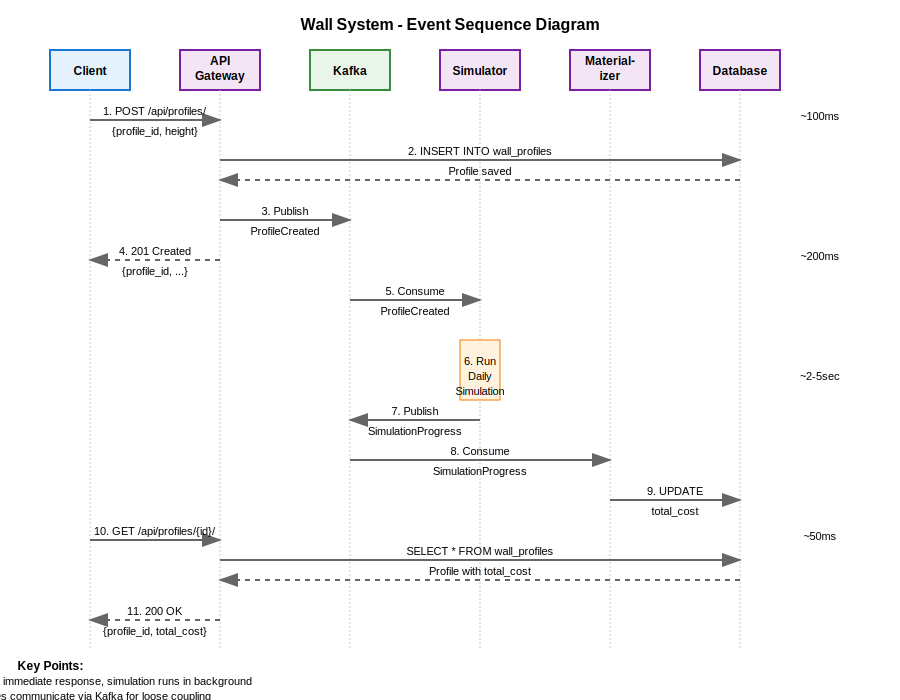
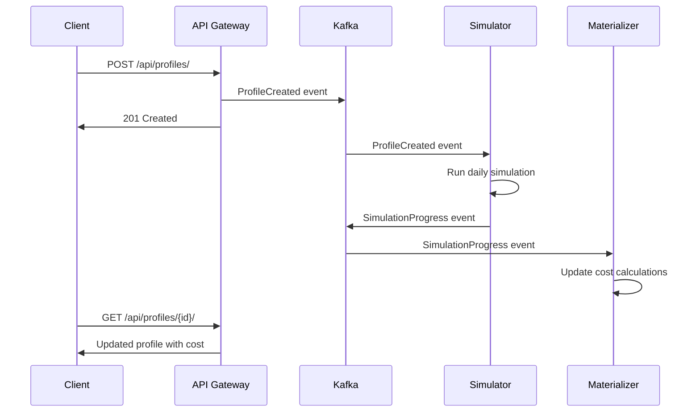

# The Wall - Construction Management System Documentation

> *"I hope the Wall is high enough."*

## Overview

The Wall is a Django REST API system designed to manage the construction of the 30-foot ice wall defending the Seven Kingdoms. This system tracks material quantities, costs, and crew management with precise calculations following the task requirements.

## Task Implementation

This system implements the exact requirements from *The Wall* construction management task:

### Story Requirements ✅
- **Wall Height**: 30 feet target for all sections
- **Materials**: 195 cubic yards of ice per foot
- **Cost**: 1,900 Gold Dragons per cubic yard
- **Daily Progress**: Each crew adds 1 foot per day
- **Crew Management**: Crews relieved when section completes

### Required API Endpoints ✅
- `GET /profiles/{id}/days/{day}/` - Daily ice usage
- `GET /profiles/{id}/overview/{day}/` - Profile cost overview
- `GET /profiles/overview/{day}/` - All profiles overview
- `GET /profiles/overview/` - Final total cost

## Architecture Components

### 🏗️ Django REST API
- **Purpose**: Primary HTTP interface for wall construction management
- **Port**: `8000`
- **Key Features**:
  - Task-specific calculation endpoints
  - Wall profile and section management
  - RESTful API following task requirements
  - Real-time construction progress tracking

### 📊 Task Calculation Engine
- **Purpose**: Core business logic for construction calculations
- **Key Features**:
  - Daily ice usage calculations
  - Cost tracking (Gold Dragons)
  - Crew management and completion logic
  - Multi-profile construction simulation

### �️ PostgreSQL Database
- **Purpose**: Persistent storage for wall data
- **Key Features**:
  - Wall profiles and sections storage
  - Construction progress tracking
  - Transactional consistency
  - Production-ready scalability

## Event Flow





## Quick Start

Get the entire system running in under 5 minutes:

```bash
# 1. Clone and setup
git clone <repository>
cd The-Wall-take-home
make dev-setup

# 2. Start all services
make dev

# 3. Create a test profile
curl -X POST http://localhost:8000/api/profiles/ \
  -H "Content-Type: application/json" \
  -d '{"profile_id": "123e4567-e89b-12d3-a456-426614174000", "height": 25.5}'
```

## Technology Stack

| Component | Technology | Purpose |
|-----------|------------|---------|
| API Gateway | Django REST Framework | HTTP API & data persistence |
| Simulation Service | FastAPI | High-performance async processing |
| Message Broker | Apache Kafka + Avro | Event streaming & schema evolution |
| Database | PostgreSQL/SQLite | Persistent storage |
| Monitoring | Prometheus + Grafana | Metrics & alerting |
| Testing | pytest + k6 | Unit & performance testing |
| Deployment | Docker Compose | Local development & deployment |

## 🏗️ Project Organization

The repository follows Django best practices and microservices architecture:

```
thewall/                    # Main Django Project
├── manage.py              # Django management script
├── apps/                  # Django applications
│   ├── profiles/          # Wall profile management
│   ├── health/            # Health check endpoints
│   └── common/            # Shared Django utilities

services/                  # Microservices
├── simulator/            # FastAPI simulation service
└── materializer/         # Event materialization service

shared/                   # Shared libraries
└── wall_common/          # Common business logic

infrastructure/           # Infrastructure & deployment
├── docker/              # Docker configurations
├── monitoring/          # Prometheus/Grafana configs
└── perf/               # k6 performance testing scripts
```

All functionality preserved with 46/46 tests passing ✅

## Development Workflow

### Prerequisites
- Python 3.12+
- Poetry for dependency management
- Docker & Docker Compose
- Make (for convenience targets)

### Common Commands

```bash
# Development setup
make dev-setup          # Install deps & run migrations
make dev                # Start full Docker stack
make test               # Run test suite
make lint               # Code quality checks

# Individual services
make runserver          # Django API only
make run-simulator      # FastAPI simulator only
make run-materializer   # Materializer only

# Performance testing
make benchmark          # Run k6 performance tests
```


